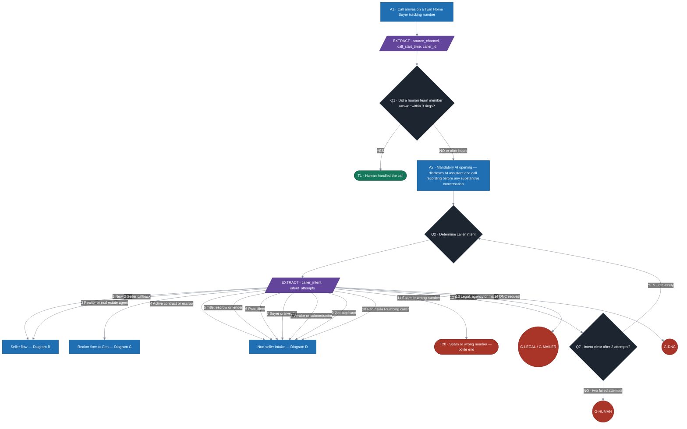
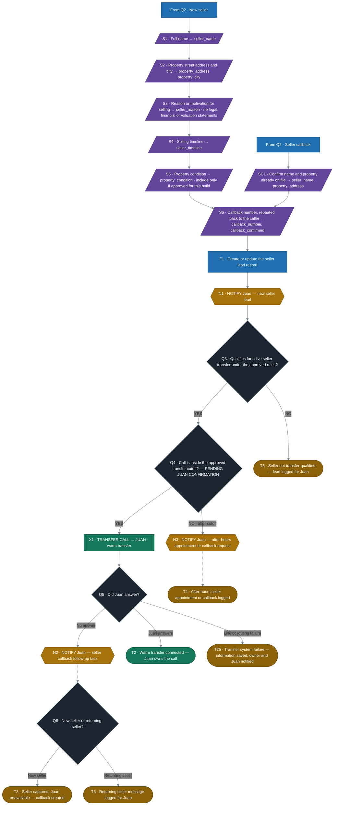
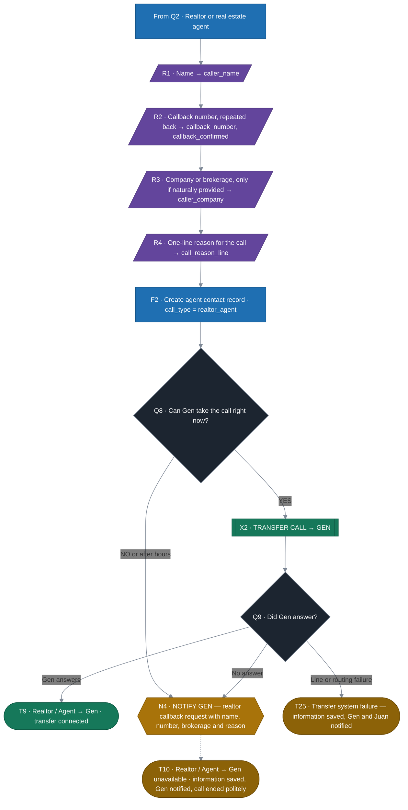
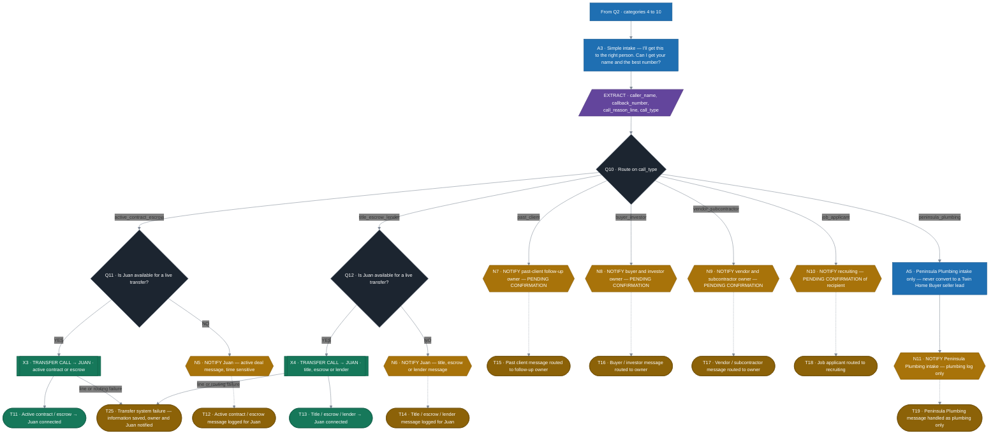
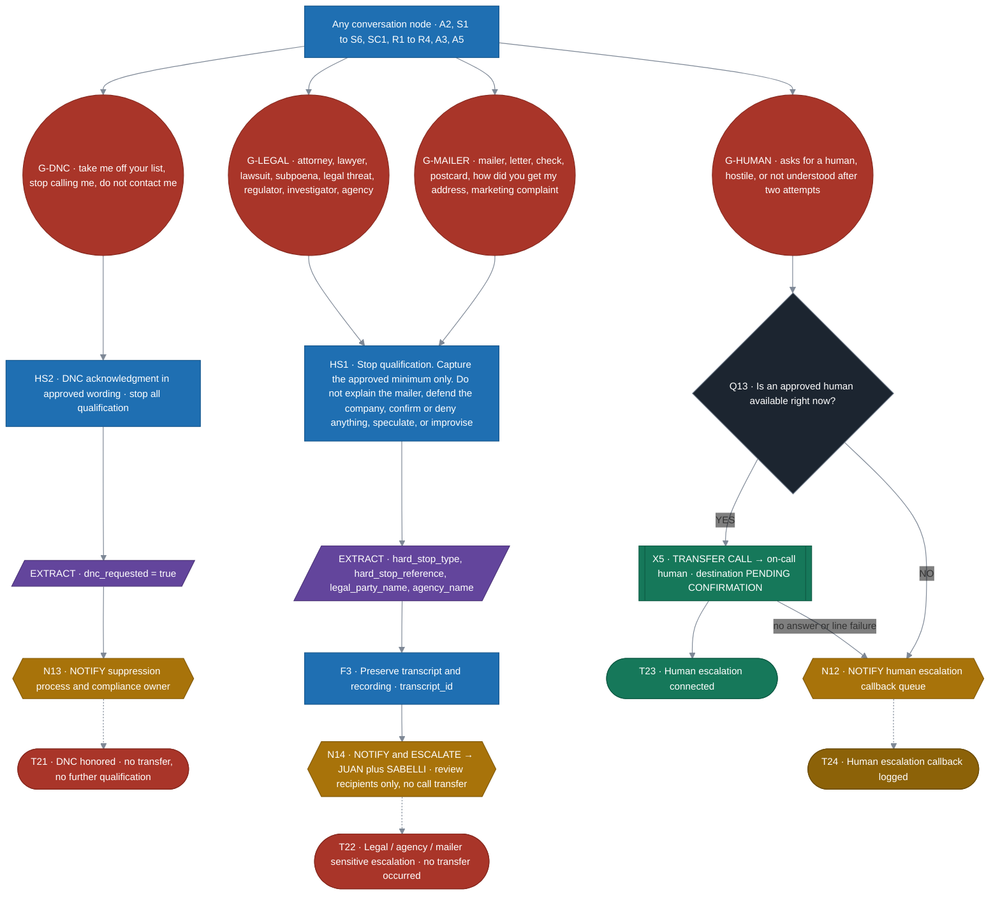

# Twin Home Buyer — Inbound Call Flowchart v2.0

**Document:** Inbound Call Flow — Retell AI Conversation Flow build spec
**Supersedes:** Inbound Call Flowchart v1.0
**Build / Retell Implementation:** [CURRENT BUILDER]
**Approve:** Juan
**Status:** Draft for approval — items marked *PENDING CONFIRMATION* are not yet approved and must not be built as written.

> **Rule of this document:** a *Transfer Call* and a *Send Notification* are two different actions.
> **Gen** is a call-transfer destination. **Sabelli** is a notification / review recipient only.

---

## 0. What changed from v1.0

| # | Area | v1.0 | v2.0 |
|---|------|------|------|
| 1 | Realtor / Agent routing | Realtor → **Mariaelena** | Realtor → **GEN** (`X2`, endings `T9` / `T10`) |
| 2 | Sabelli | Treated as a person callers could be sent to | **Notification / escalation recipient only** on approved `T22` cases. No transfer node exists for Sabelli anywhere in the flow. |
| 3 | Legal / agency / mailer | Mixed into normal qualification | Isolated global hard-stop layer (`G-LEGAL`, `G-MAILER`) → `T22` notification to **Juan + Sabelli** |
| 4 | DNC | Handled ad hoc | Global node `G-DNC` → `T21`, sets `dnc_requested = true`, suppression process |
| 5 | Endings | Some branches unterminated | 24 named endings, every branch terminates |
| 6 | Build owner | Build: Seth | Build / Retell Implementation: **[CURRENT BUILDER]** |

**Retired ending IDs:** `T7` and `T8` were the v1.0 *Realtor → Mariaelena* endings (connected / message taken). They are retired and must not be rebuilt. The realtor branch now ends at `T9` / `T10`.

---

## 1. Legend

| Style | Meaning | Retell node type | Shape in diagrams |
|-------|---------|------------------|-------------------|
| **BLUE** | Conversation / action | Conversation node, Function node | rectangle |
| **DARK / BLACK** | Decision | Logic Split node | diamond |
| **GREEN** | Successful transfer / completed outcome | Transfer Call node, Ending node | subroutine / stadium |
| **YELLOW** | Notification / follow-up | Function node (webhook — no audio path) | hexagon |
| **RED** | Hard stop — legal / DNC / sensitive | Global node + Ending node | circle / stadium |
| **PURPLE** | Extract variable / data capture | Extract Dynamic Variables on a Conversation node | parallelogram |

**Edge styles — this distinction is load-bearing:**

- `──▶` **solid arrow** = the live call moves. Audio path. This is a *Transfer Call*.
- `--▶` **dashed arrow** = information moves, the call does not. This is a *Send Notification*.

Sabelli is only ever reached by a dashed arrow.

---

## 2. Master flow

### 2.1 Diagram A — Call arrival and intent routing

### 2.2 Diagram B — Seller flow

Only seller calls (`caller_intent = new_seller` or `seller_callback`) run the qualification conversation.

**Notes on Diagram B**

- The transfer cutoff time is **PENDING JUAN CONFIRMATION**. Do not build a cutoff value until it is supplied.
- The live-transfer qualification test at `Q3` uses the approved Twin Home Buyer rules; the rule set itself is **PENDING JUAN CONFIRMATION**.
- `S5` (property condition) is built **only** if that field is approved for the Retell build. Otherwise the node is skipped and `property_condition` stays null.
- `N1` fires on every completed seller intake, whether or not a transfer happens, so no seller is ever captured without Juan being told.

### 2.3 Diagram C — Realtor / Agent → GEN (changed routing)

**Hard rules on this branch**

- Realtor / agent calls route to **GEN**. Not Mariaelena. Not Sabelli.
- No normal realtor notification goes to Sabelli.
- There is no edge of any kind from this branch to Sabelli.

### 2.4 Diagram D — Non-seller intake and routing

The AI does not attempt to answer substantive questions on these calls. It takes a message and routes.

Intake script: *"I'll get this to the right person. Can I get your name and the best number?"*

### 2.5 Diagram E — Global hard-stop layer

These four global nodes can interrupt the conversation from **any** node. A hard stop overrides the seller and non-seller flows.

**Sabelli rule.** `N14` is a notification. The call does not move. There is no `Transfer to Sabelli` node in this build, and none may be added. Sabelli appears exactly once in the flow, as a review recipient on `T22`.

**Proposed hard-stop precedence** — *PENDING JUAN CONFIRMATION*: `G-DNC` → `G-LEGAL` → `G-MAILER` → `G-HUMAN` → normal flow. If a caller both requests DNC and raises a legal or mailer matter, the proposal is to honor the DNC (`T21`) **and** send the `T22` notification, recording both endings. Do not build the combination rule until it is confirmed.

---

## 3. Retell node map

| Flow node | Retell node type | Purpose | Exits |
|---|---|---|---|
| `A1` | Call start / inbound trigger | Entry on a tracking number | `V1` |
| `V1` | Extract Dynamic Variables | `source_channel`, `call_start_time`, `caller_id` | `Q1` |
| `Q1` | Logic Split | Human answered within 3 rings | `T1`, `A2` |
| `A2` | Conversation | Mandatory AI + recording disclosure | `Q2` |
| `Q2` | Logic Split (14-way) | Intent classification | `V2` |
| `V2` | Extract Dynamic Variables | `caller_intent`, `intent_attempts` | seller / realtor / non-seller / stops |
| `S1`–`S6`, `SC1` | Conversation + Extract | Seller qualification capture | next in sequence |
| `F1` | Function | Create or update seller lead | `N1` |
| `N1`–`N14` | Function (webhook) | Send notification — **no audio path** | ending |
| `Q3`–`Q13` | Logic Split | Routing and availability tests | per diagram |
| `X1`–`X5` | Transfer Call | Move the live call | ending or failure branch |
| `R1`–`R4` | Conversation + Extract | Realtor capture | `F2` |
| `F2` | Function | Create agent contact record | `Q8` |
| `A3` | Conversation | Non-seller simple intake | `V3` |
| `V3` | Extract Dynamic Variables | `caller_name`, `callback_number`, `call_reason_line`, `call_type` | `Q10` |
| `A5` | Conversation | Peninsula Plumbing intake only | `N11` |
| `G-LEGAL`, `G-MAILER`, `G-DNC`, `G-HUMAN` | Global node | Interrupt from anywhere | `HS1`, `HS2`, `Q13` |
| `HS1`, `HS2` | Conversation | Constrained hard-stop scripts | `V4`, `V5` |
| `F3` | Function | Preserve transcript and recording | `N14` |
| `T1`–`T26` | Ending node | Terminal disposition | — |

---

## 4. Conversation nodes

| ID | Name | Notes |
|---|---|---|
| `A1` | Call arrives | Stores `source_channel` |
| `A2` | Mandatory AI opening | AI disclosure + recording disclosure before any substantive conversation. Approved Twin Home Buyer opening text — **PENDING CONFIRMATION** of final wording. |
| `A3` | Non-seller simple intake | "I'll get this to the right person. Can I get your name and the best number?" |
| `A5` | Peninsula Plumbing intake | Plumbing only. Never converts to a seller lead. |
| `S1`–`S6` | Seller qualification prompts | See Diagram B |
| `SC1` | Returning-seller confirmation | Confirms name and property already on file |
| `R1`–`R4` | Realtor capture prompts | Name, number, brokerage, one-line reason |
| `HS1` | Hard-stop minimum capture | No explanation, defense, confirmation, denial or speculation |
| `HS2` | DNC acknowledgment | Approved wording — **PENDING CONFIRMATION** |
| `F1` | Create or update seller lead | Function node |
| `F2` | Create agent contact record | Function node |
| `F3` | Preserve transcript and recording | Function node |

## 5. Decision nodes

| ID | Question | Exits |
|---|---|---|
| `Q1` | Did a human answer within 3 rings? | YES → `T1` · NO / after hours → `A2` |
| `Q2` | Which of the 14 caller intents? | 14 exits |
| `Q3` | Qualifies for a live seller transfer? | YES → `Q4` · NO → `T5` |
| `Q4` | Inside the approved transfer cutoff? *(cutoff PENDING JUAN CONFIRMATION)* | YES → `X1` · NO → `N3` |
| `Q5` | Did Juan answer the warm transfer? | Answered → `T2` · No answer → `N2` · Failure → `T25` |
| `Q6` | New seller or returning seller? | `T3` / `T6` |
| `Q7` | Intent clear after 2 attempts? | YES → `Q2` · NO → `G-HUMAN` |
| `Q8` | Can Gen take the call now? | YES → `X2` · NO → `N4` |
| `Q9` | Did Gen answer? | Answered → `T9` · No answer → `N4` · Failure → `T25` |
| `Q10` | Route on `call_type` | 7 exits |
| `Q11` | Juan available — active contract or escrow? | YES → `X3` · NO → `N5` |
| `Q12` | Juan available — title, escrow or lender? | YES → `X4` · NO → `N6` |
| `Q13` | Approved human available now? | YES → `X5` · NO → `N12` |

## 6. Global nodes

| ID | Trigger phrases and conditions | Action | Ending |
|---|---|---|---|
| `G-LEGAL` | Attorney, lawyer, lawsuit, subpoena, legal threat, regulator, investigator, government or consumer-protection agency | Stop qualification → `HS1` | `T22` |
| `G-MAILER` | Mailer, letter, check, postcard, "how did you get my address", complaint about previous marketing correspondence | Stop qualification → `HS1` | `T22` |
| `G-DNC` | "Take me off your list", "stop calling me", "do not contact me" or equivalent | Stop conversation → `HS2`, set `dnc_requested = true` | `T21` |
| `G-HUMAN` | Explicit request for a human, hostile caller, or not understood after two attempts | Stop qualification → `Q13` | `T23` / `T24` |

Each global node is reachable from `A2`, `S1`–`S6`, `SC1`, `R1`–`R4`, `A3` and `A5`.

## 7. Transfer Call nodes

Every entry here moves the live call. There are five, and none of them is Sabelli.

| ID | Destination | Trigger | Success | Failure |
|---|---|---|---|---|
| `X1` | **Juan** | Qualified seller inside the cutoff | `T2` | `N2` → `T3` / `T6`, or `T25` |
| `X2` | **GEN** | Realtor or real estate agent | `T9` | `N4` → `T10`, or `T25` |
| `X3` | **Juan** | Active contract or escrow | `T11` | `N5` → `T12` |
| `X4` | **Juan** | Title, escrow or lender | `T13` | `N6` → `T14` |
| `X5` | **On-call human** — *PENDING CONFIRMATION* | Human requested or hostile caller | `T23` | `N12` → `T24` |

A `X6` transfer to a Peninsula Plumbing line is **PENDING CONFIRMATION**; until a number is approved, plumbing calls take a message only (`T19`).

## 8. Notification nodes

Every entry here sends information. None of them moves the call.

| ID | Recipient | Content | Fires at |
|---|---|---|---|
| `N1` | Juan | New seller lead, all captured fields | Every completed seller intake |
| `N2` | Juan | Seller callback follow-up task | Warm transfer not answered |
| `N3` | Juan | After-hours seller appointment or callback | Outside the transfer cutoff |
| `N4` | **Gen** | Realtor callback request — name, number, brokerage, reason | Gen unavailable or no answer |
| `N5` | Juan | Active deal message, time sensitive | Juan unavailable |
| `N6` | Juan | Title, escrow or lender message | Juan unavailable |
| `N7` | Past-client follow-up owner — *PENDING* | Past-client message | Always |
| `N8` | Buyer / investor owner — *PENDING* | Buyer or investor message | Always |
| `N9` | Vendor / subcontractor owner — *PENDING* | Vendor message | Always |
| `N10` | Recruiting — *PENDING* | Applicant name, number, role interest | Always |
| `N11` | Peninsula Plumbing intake | Plumbing message, plumbing log only | Always |
| `N12` | Human escalation queue | Hostile or human-requested callback | No human available |
| `N13` | Suppression process + compliance owner — *PENDING* | DNC request | On `G-DNC` |
| `N14` | **Juan + Sabelli** | Sensitive legal / agency / mailer escalation with transcript and recording | On `G-LEGAL` or `G-MAILER` |

`N14` is the only notification Sabelli receives, and it is a review notification, not a transfer.

## 9. Extract variables

| Variable | Captured at | Required | Notes |
|---|---|---|---|
| `source_channel` | `V1` | yes | Tracking number the call arrived on |
| `call_start_time` | `V1` | yes | Used by the cutoff test at `Q4` |
| `caller_id` | `V1` | yes | Inbound number |
| `human_answered` | `Q1` | yes | Drives `T1` |
| `caller_intent` | `V2` | yes | One of the 14 categories |
| `intent_attempts` | `V2` | yes | Two failures route to `G-HUMAN` |
| `seller_name` | `S1` / `SC1` | yes for sellers | |
| `property_address` | `S2` / `SC1` | yes for sellers | Street address |
| `property_city` | `S2` | yes for sellers | |
| `seller_reason` | `S3` | yes for sellers | Motivation, captured verbatim |
| `seller_timeline` | `S4` | yes for sellers | |
| `property_condition` | `S5` | conditional | Only if this field is approved for the build |
| `callback_number` | `S6` / `R2` / `V3` | yes | |
| `callback_confirmed` | `S6` / `R2` | yes | Set true only after the number is repeated back |
| `caller_name` | `R1` / `V3` | yes for non-sellers | |
| `caller_company` | `R3` | optional | Brokerage, only if naturally provided |
| `call_reason_line` | `R4` / `V3` | yes for non-sellers | One line, no interpretation |
| `call_type` | `V3` | yes for non-sellers | Routing key at `Q10` |
| `transfer_attempted` | `X1`–`X5` | system | |
| `transfer_result` | `X1`–`X5` | system | `connected`, `no_answer`, `failed` |
| `dnc_requested` | `V5` | on `G-DNC` | Set `true`, triggers suppression |
| `hard_stop_type` | `V4` | on hard stop | `legal`, `agency`, `mailer` |
| `hard_stop_reference` | `V4` | on hard stop | Mailer, letter, check or postcard reference if the caller offers one |
| `legal_party_name` | `V4` | on legal stop | Attorney, firm or caller name |
| `agency_name` | `V4` | on agency stop | |
| `transcript_id` | `F3` | on hard stop | Preserved transcript and recording |
| `hostile_flag` | `G-HUMAN` | conditional | |
| `plumbing_issue_summary` | `A5` | for plumbing calls | Plumbing log only |
| `applicant_role_interest` | `A3` | for applicants | |

## 10. Ending nodes

| ID | What happened | Owner | Notification | Transfer | CRM action | Follow-up |
|---|---|---|---|---|---|---|
| `T1` | Human answered within 3 rings | Answering team member | No | No — human answered directly | Logged by the team member per existing process | Owned by whoever answered |
| `T2` | Qualified seller warm-transferred and connected | Juan | Lead summary to Juan | **Yes → Juan** | Seller lead with all `S1`–`S6` fields | Juan owns from the transfer forward |
| `T3` | Seller captured, Juan did not answer | Juan | `N1` + `N2` | Attempted, not connected | Seller lead, `transfer_result = no_answer` | Callback task for Juan — SLA *PENDING* |
| `T4` | Seller call outside the transfer cutoff | Juan | `N1` + `N3` | No | Seller lead, after-hours flag | Approved after-hours appointment or callback process — *PENDING* |
| `T5` | Seller did not meet the live-transfer rules | Juan | `N1` | No | Seller lead, `transfer_eligible = false` | Juan reviews the lead |
| `T6` | Returning seller, message taken | Juan | `N1` + `N2` | Attempted or skipped | Appended to the existing lead | Juan callback |
| `T9` | **Realtor / agent transferred to Gen and connected** | **Gen** | Contact record to Gen | **Yes → Gen** | Agent contact with reason | Gen owns the call |
| `T10` | Realtor / agent — Gen unavailable | **Gen** | `N4` | No, or attempted and not connected | Agent contact saved | Gen callback — SLA *PENDING* |
| `T11` | Active contract / escrow connected to Juan | Juan | Message summary | **Yes → Juan** | Attached to the deal record | Juan |
| `T12` | Active contract / escrow message taken | Juan | `N5` | Attempted, not connected | Attached to the deal record, time-sensitive flag | Juan same business day — *PENDING* |
| `T13` | Title / escrow / lender connected to Juan | Juan | Message summary | **Yes → Juan** | Attached to the relevant file | Juan |
| `T14` | Title / escrow / lender message taken | Juan | `N6` | Attempted, not connected | Attached to the relevant file | Juan |
| `T15` | Past client message routed | Follow-up owner — *PENDING* | `N7` | No | Past-client record updated | Owner callback — *PENDING* |
| `T16` | Buyer / investor message routed | Buyer-investor owner — *PENDING* | `N8` | No | Buyer list record | Owner callback — *PENDING* |
| `T17` | Vendor / subcontractor message routed | Internal owner — *PENDING* | `N9` | No | Vendor record | Owner callback — *PENDING* |
| `T18` | Job applicant routed to recruiting | Recruiting — *PENDING* | `N10` | No | Applicant record | Recruiting process |
| `T19` | Peninsula Plumbing call handled as plumbing | Peninsula Plumbing | `N11` | No — transfer line *PENDING* | Plumbing log only. **Never** the Twin Home Buyer seller pipeline | Plumbing process |
| `T20` | Spam or wrong number | None | No | No | Disposition `spam_wrong_number` | None. Optionally add to the screening list |
| `T21` | **DNC honored** | Compliance owner — *PENDING* | `N13` | **No** | `dnc_requested = true`, suppress across all marketing lists | Confirm suppression applied within the approved window — *PENDING* |
| `T22` | **Legal / agency / mailer sensitive escalation** | Juan | `N14` → **Juan + Sabelli** with transcript | **No — and no transfer to Sabelli exists** | Restricted sensitive-matter record | Juan and Sabelli review. Caller told someone will follow up — wording *PENDING* |
| `T23` | Human escalation connected | On-call human — *PENDING* | Call summary | **Yes → on-call human** | Call note | Human owns the call |
| `T24` | Human escalation callback logged — includes unclear callers after two attempts | On-call human — *PENDING* | `N12` | No | Call note with partial capture | Human callback — SLA *PENDING* |
| `T25` | Transfer failed technically — line or routing error | Intended destination + Juan | Notification to the intended owner and Juan | Attempted, failed | Full capture saved, `transfer_result = failed` | Callback by the intended owner |
| `T26` | Caller disconnected mid-flow | Depends on capture | Only if seller, realtor or hard-stop content was captured | No | Partial capture saved with `call_incomplete = true` | Callback if a confirmed number exists |

**How `T26` is reached.** `T26` has no incoming edge in the diagrams by design. It is wired to Retell's call-ended / caller-hung-up event on every conversation node, so a dropped call always lands on a named disposition instead of vanishing.

**Retired:** `T7`, `T8` — the v1.0 *Realtor → Mariaelena* endings. Do not rebuild.

---

## 11. Pending confirmation

Nothing in this list may be built as a guess. Each needs Juan's or Cherry's sign-off first.

| # | Item | Needed from | Blocks |
|---|---|---|---|
| 1 | **Seller transfer cutoff time** and the after-hours boundary | Juan | `Q4`, `T4` |
| 2 | **Seller live-transfer qualification rules** — what makes a seller transfer-worthy | Juan | `Q3`, `T5` |
| 3 | Whether **`S5` property condition** is approved for this build | Juan | `S5` |
| 4 | Approved **AI opening wording** (`A2`) | Juan / Cherry | `A2` |
| 5 | Gen's **transfer number and availability hours** | Juan / Gen | `X2`, `Q8` |
| 6 | **Past-client** follow-up owner | Juan | `N7`, `T15` |
| 7 | **Buyer / investor** owner | Juan | `N8`, `T16` |
| 8 | **Vendor / subcontractor** owner | Juan | `N9`, `T17` |
| 9 | **Recruiting** notification recipient | Juan / Cherry | `N10`, `T18` |
| 10 | Whether Peninsula Plumbing calls may be **transferred** to a plumbing line, or message-only | Juan | `X6`, `T19` |
| 11 | **On-call human** destination and hours for escalation | Juan | `X5`, `Q13`, `T23` |
| 12 | **DNC suppression** administrator and confirmation window | Juan / Cherry | `N13`, `T21` |
| 13 | Approved **caller-facing wording** for `HS1`, `HS2` and the `T22` close | Juan / Cherry | `HS1`, `HS2`, `T22` |
| 14 | **Hard-stop precedence** and the DNC-plus-legal combination rule | Juan | Global layer |
| 15 | **Callback SLAs** for `T3`, `T10`, `T12`, `T24` | Juan | Follow-up tasks |
| 16 | Notification channel — SMS, email or CRM task — per recipient | Juan | All `N` nodes |
| 17 | Name of the **[CURRENT BUILDER]** for the title block | Juan | Document header |
